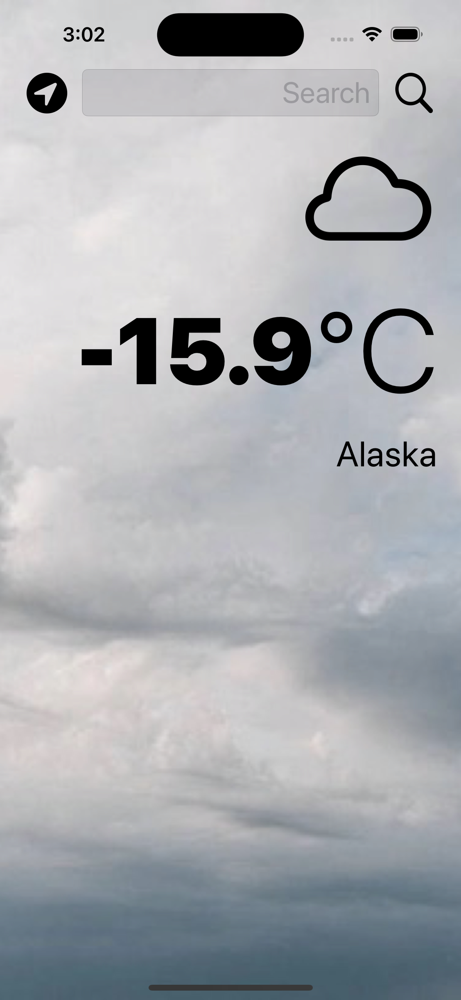
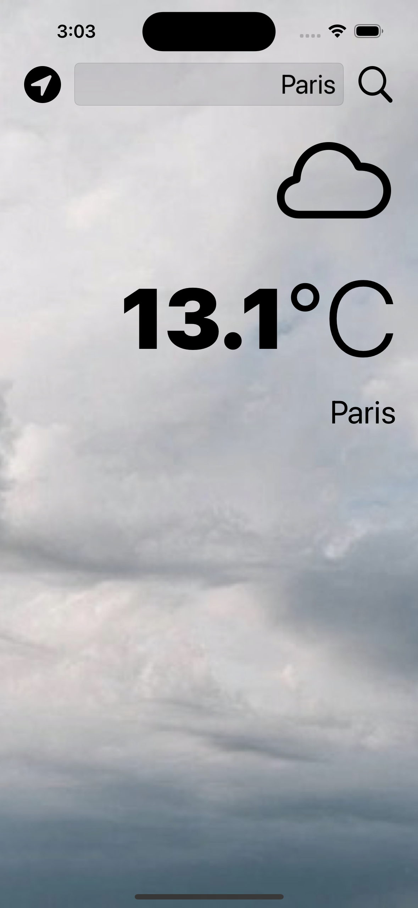
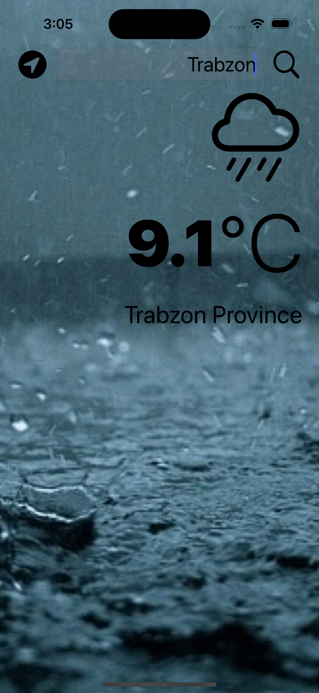

# Weather-App

- Application that displays instant weather information based on where the user enters
- I reflected the api information from the openweather.com site to the screen. What is the weather condition of the place you are looking for, the picture in the background changes accordingly.

|||||| || 

